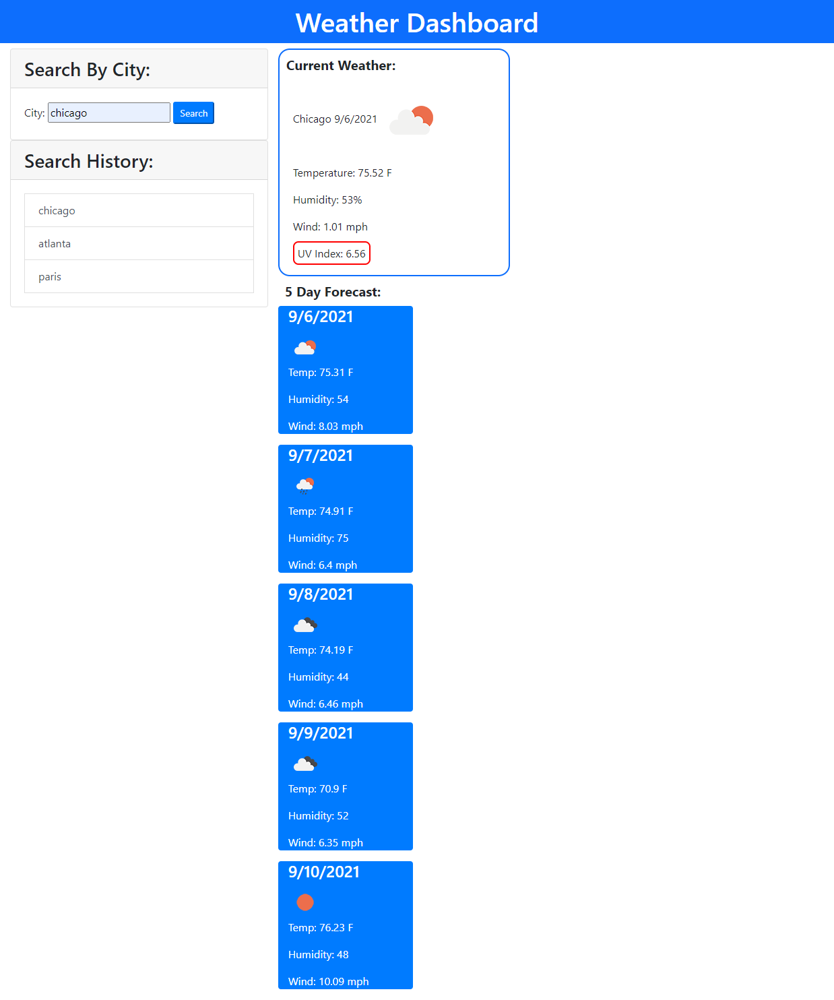

# Weather Dashboard

## Link to public repo on Github:

https://github.com/jcapadocia3/Weather-Dashboard

## Link to public Github page URL:

https://jcapadocia3.github.io/Weather-Dashboard/

## Final webpage project image:

## About Project

This project is intended to present a user with a way to see the current weather and a 5 day forecast for the city they input and search in the appropriate field.

### How the project functions

- The user will be presented with a simple interface in which he/she can enter/search for a city that they would like to see the weather for.

- When a city is searched, the user will be presented with 3 bits of information:

1) The current weather (displayed in a large box) that will show the city, date, and weather conditions in the area. Within this box, they will also see the current UV Index that will be color coded by a surrounding border based on if the ultraviolet radiation levels are deemed as safe (green border), moderate (yellow border), or alarming (red border)
2) A 5 Day Forecast that will represent the same city's weather conditions for the next 5 days
3) A box that will display a list of previously Searched Cities submitted by the user

- When the user clicks on a city that is saved in the Search History, the page will refresh with that city's information presented.
